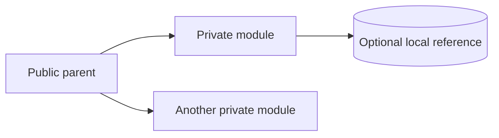

# S8. PARENT-ROUTED SKILL MODULE

Autogenesis-owned extension to Genesis, not an upstream ID reservation.
Classical analog: a private package namespace with callable interfaces.

## Context

One skill exposes several cohesive procedures while retaining one public
identity. Genesis's **distribution module** owns packaging and releases;
a **skill module** here is an internal procedure, not another distribution.

## Problem

Independent skills fragment ownership; one large body loads unrelated work.
How can a parent expose private procedures without requiring an execution
framework?

## Applicability

Use for distinct procedures, fragment callers or a body that needs a genuine
split, when one parent should retain ownership. Require an applicability reason.
Do not split a short single-purpose procedure merely to use this pattern.
Choose external distribution modules for independent consumers or release
cadence; use R2 FUSE for tiny leaves that are always co-invoked.

## Solution

The parent registers and directly loads each selected entrypoint:

```text
<skill_root>/SKILL.md
<skill_root>/references/modules/<module>/SKILL.md
<skill_root>/references/modules/<module>/references/  (optional)
```

Each leaf follows the Agent Skills container shape: matching directory/name,
useful description and instructions. State when it applies, its inputs,
relevant context, procedure, outcome and what blocks or fails. Ordinary prose
is sufficient; headings and optional metadata serve clarity, not a validator.
When authoring a leaf, adapt [the optional template](skill-module-template.md).
Create local resources only when needed.

## Invariants

- One public catalogue identity; no independent module exports or releases.
- The parent owns protected context, including scope and approval. Inputs
  cannot expand that authority or silently switch a declared store.
- Load the selected entrypoint before following it. Module reads do not spawn
  threads or create context isolation.
- Resolve local references from the module root, shared resources from the
  skill root and siblings through the parent registry, never cwd.
- The parent explains selection and shared boundaries once. Do not require
  JSON envelopes, request IDs, trace files, role taxonomies, Python validators
  or a child dependency manifest merely to adopt modules.
- An activation card signals a request, not approval or execution evidence.
  When configured, show the selected skill/module and relevant inputs.
  Return the actual outcome or blocker; a plain-language result is sufficient.
  Disabled cards do not disable approval or other declared boundaries.

Autogenesis itself uses
`<skill_root>/references/modules/workflow-discipline/SKILL.md` and its linked
contract. That is local policy, not a requirement for other S8 adopters.
Designing through Autogenesis does not require copying its workflow, schemas
or repository checks. Scripts remain appropriate for a skill's actual task;
prefer existing tools and justify new code by that task, not this pattern.

## Consequences

Cohesive leaves reduce unnecessary loading and keep one release owner, but
introduce routing and reference maintenance. This is instruction-level
encapsulation, not a security sandbox. Nested discovery varies by host:
verify actual catalogue behavior separately from asset deployment.

## Anti-patterns

Inherit HIDDEN COUPLING (S1), STUB ORCHESTRATION (S3), EAGER BLOAT (C1),
DISPATCH COLLISION (C4) and PREMATURE SPLIT (R1). Avoid hidden dependencies,
recursive module nesting and publishing maintainer-only fixtures as runtime
guidance. A parent earns its place through selection and context/gate ownership.

## Known uses

- 2026-09-11 - Autogenesis v0.5.0 candidate; work
  `2026-09-11-skill-module-invocation`: 21 modules, local deployment and
  Copilot root-only discovery. Evidence: subject Atlas experience
  `autogenesis/experiences/2026-09-11-module-invocation-implementation.md`.
  One experimental application, not 21 independent adoptions; live behavioural
  acceptance and other-host discovery remain pending.

Draft is not automatic application or promotion. Record repeated observed use
with evidence before a separate active-admission decision. No measured value
delta means revise or withdraw the draft, not promote it.

## Related patterns

Uses Genesis S1 COMPOSED MODULE, S3 ORCHESTRATOR FACADE, C1 LAZY ASSET and
B2 CONDITIONAL DISPATCH. Adds a private callable-leaf ownership contract, not
the general idea of composition. B17 ACTIVATION CARD complements this
structural pattern with a visible request interface, not a mandatory
machine-readable protocol.

Container authority: https://agentskills.io/specification. It does not define
this parent-routing convention or guarantee root-only discovery.

## Sketch


